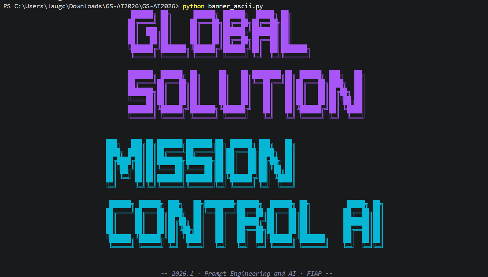

# 🚀 Mission Control AI — EnviroSat Guardian

## 👨‍💻 Integrantes

* Laura Godoy Callegari — RM: 569181 — Turma: 1CCPJ
* Mariana Dreset Carbollan — RM: 569207 — Turma: 1CCPJ

---

# 🌎 O que o projeto faz

O Mission Control AI — EnviroSat Guardian é um sistema inteligente de monitoramento ambiental baseado em telemetria simulada de satélites de observação terrestre.

O projeto utiliza IA generativa integrada via Ollama Cloud para interpretar dados ambientais em tempo real, detectar possíveis incêndios florestais, degradação vegetal, falhas operacionais e gerar análises contextualizadas em linguagem natural para operadores ambientais.

A solução conecta tecnologia espacial ao impacto terrestre, auxiliando no monitoramento ambiental, combate a incêndios e preservação de áreas protegidas.

---

# 🛰️ Persona atendida

O sistema foi desenvolvido para atender operadores de monitoramento ambiental, coordenadores de brigadas anti-incêndio e analistas de compliance ambiental.

A IA auxilia esses profissionais na interpretação rápida da telemetria orbital, permitindo respostas mais eficientes diante de riscos ambientais críticos.

---

# ⚙️ Tecnologias utilizadas

* Python 3.10+
* Ollama Cloud API
* Modelo gpt-oss:120b
* Rich
* Prompt Toolkit
* PyFiglet
* Python Dotenv
* JSON
* CLI interativa estilo Claude Code

---

# 📂 Estrutura do projeto

mission-control-ai/
│
├── main.py
├── requirements.txt
├── README.md
├── .env.example
├── banner_ascii.py
│
├── src/
│   ├── __init__.py
│   ├── ui.py
│   ├── engine.py
│   ├── telemetria.py
│   └── alertas.py
│
├── prompts/
│   └── system_prompt.md
│
├── data/
│   └── cenarios.json
│
└── assets/
    ├── banner.png
    └── analise_AI.png

---

# ▶️ Como executar

## 1. Clone o repositório


git clone  https://github.com/codebylaura07/envirosat-guardian


---

## 2. Entre na pasta do projeto

```bash
cd GS-AI2026
```

---

## 3. Crie o ambiente virtual

### Windows

```bash
python -m venv .venv
.venv\Scripts\activate
```

### Linux / MacOS

```bash
python -m venv .venv
source .venv/bin/activate
```

---

## 4. Instale as dependências

```bash
pip install -r requirements.txt
```

---

## 5. Configure o arquivo `.env`

Crie um arquivo `.env` na raiz do projeto:

```env
OLLAMA_API_KEY=sua_chave_aqui
```

---

## 6. Execute o sistema

```bash
python main.py
```

---

# 🧠 Funcionalidades implementadas

✅ Simulação de telemetria orbital

✅ Detecção de anomalias ambientais

✅ Geração automática de alertas

✅ Integração com IA generativa

✅ Histórico de telemetria

✅ Cenários de teste simulados

✅ Interface CLI moderna estilo Claude Code

✅ Análise contextual em linguagem natural

---

# 🌲 Cenários de teste demonstrados

## 1. Operação nominal

Todos os parâmetros operando dentro do esperado.

---

## 2. Incêndio florestal crítico

Grande quantidade de focos de calor detectados na Amazônia com risco ambiental elevado.

---

## 3. Desmatamento suspeito

Queda significativa do NDVI indicando possível degradação vegetal.

---

## 4. Buffer quase saturado

Grande volume de imagens aguardando transmissão.

---

## 5. Bateria crítica

Baixa disponibilidade energética comprometendo a missão.

---

# 📸 Demonstração

## banner da missão



---


# 🤖 System Prompt

O system prompt utilizado no projeto está disponível em:

```text
prompts/system_prompt.md
```

O prompt instrui a IA a:

* interpretar telemetria orbital;
* detectar riscos ambientais;
* explicar impactos terrestres;
* recomendar ações operacionais;
* responder em português brasileiro.

---

# ⚠️ Limitações conhecidas

* Os dados de telemetria são simulados.
* Não existe integração com satélites reais.
* O sistema depende de conexão com a API Ollama Cloud.
* Não há persistência em banco de dados.
* A interface é exclusivamente terminal (CLI).

---

# 🌍 Impacto terrestre

O projeto demonstra como satélites ambientais podem auxiliar no combate a incêndios florestais, monitoramento de desmatamento e preservação ambiental.

A integração entre IA generativa e telemetria espacial reduz o tempo de interpretação operacional e melhora a tomada de decisão em cenários críticos.

---

# 🎬 Vídeo de demonstração

🔗 https://youtu.be/wG5dw21e5Rk?si=oXxJsAp7t8zxXVSP
---

# 📚 Disciplina

Global Solution 2026.1
FIAP — Ciência da Computação
Prompt Engineering and Artificial Intelligence
